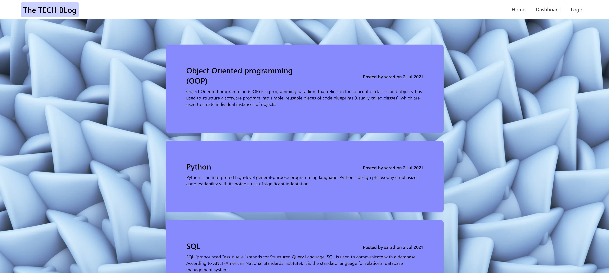
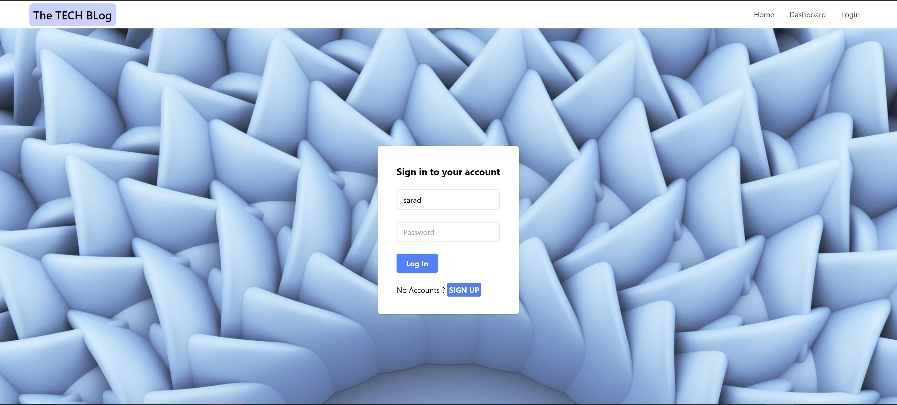
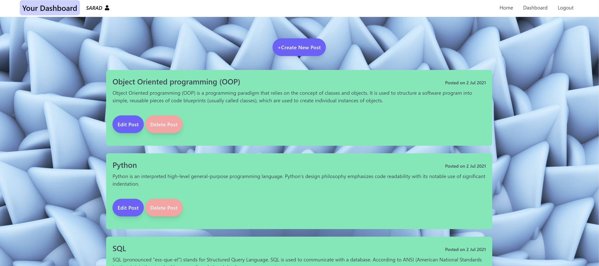
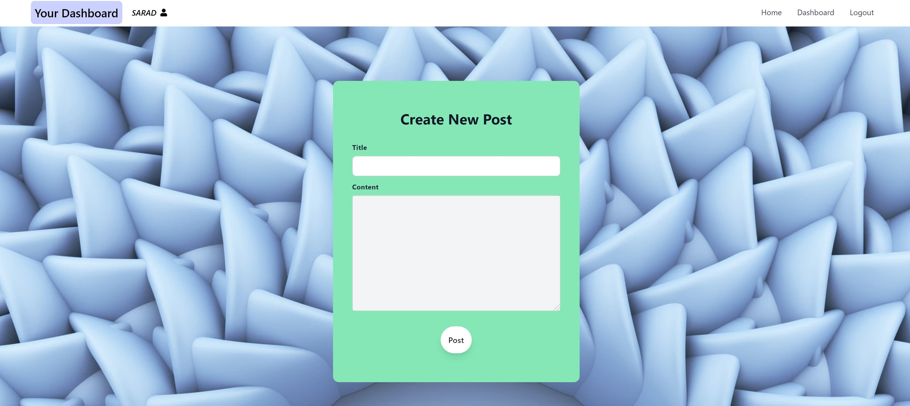

# Tech-Blog

## Description

This is a simple blog site where developers can publish their blog posts about new technologies and comment on other developers post as well. This application follow MVC paradigm in its architectural strucutre, using Handlebars.js as the templating language,Sequelize as the ORM and express-session for user authentication.

## Table of Contents

- [Deployed Link](#link)

- [Screenshots](#screenshots)

- [License](#license)

- [Usage](#usage)

- [Test](#tests)

- [Contribute](#contribute)

- [Questions](#questions)

## Application Deployed Link

[The Tech BLog](https://dudley-mountie-64122.herokuapp.com/)

## Screenshots

## Usage

Just sign up, create a new user account and you be able to view, post and comment.

## License

This project is licensed under MIT license.

## Tests

Testing not available at the moment but feedback is appreciated.

## Contribute

No contribution available at the moment.

## Questions

For any questions, please contact

- lochan.sharad@gmail.com

- [GitHub](https://github.com/best15)
